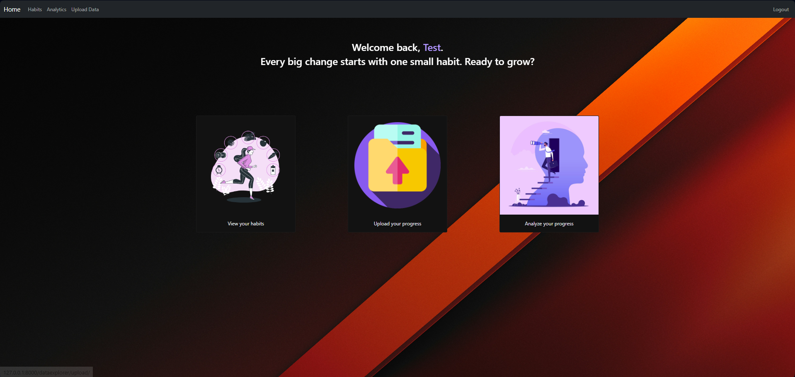
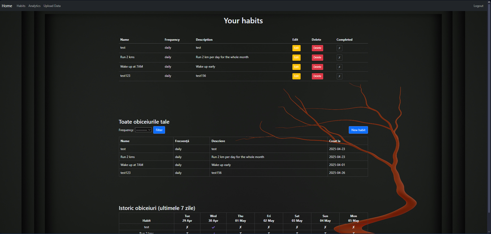
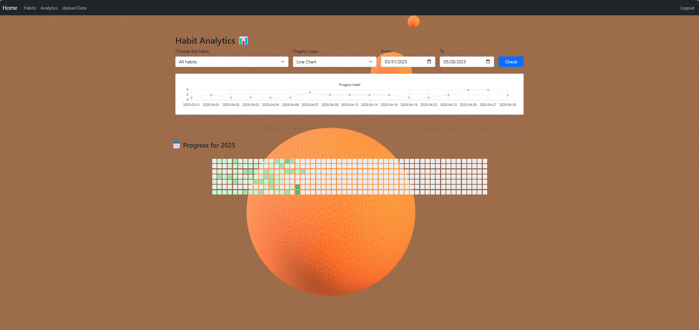
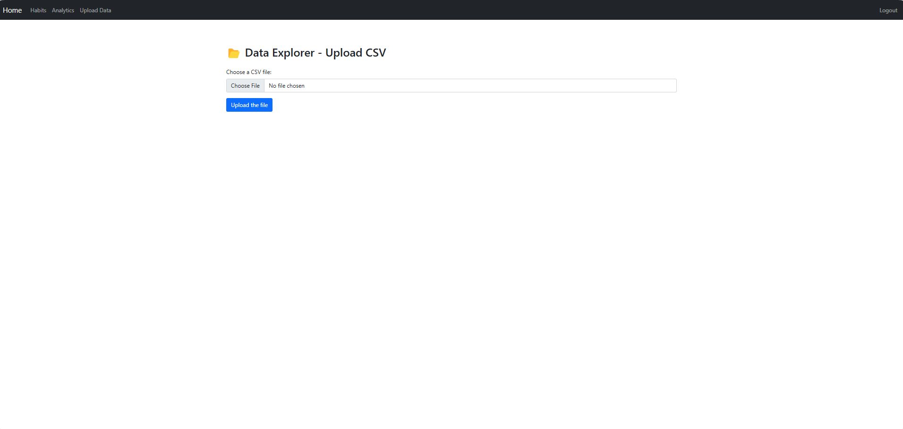
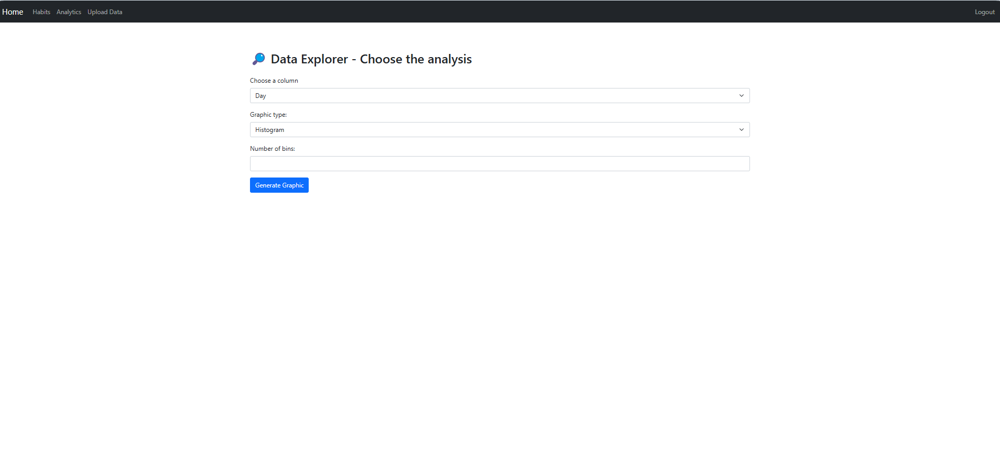
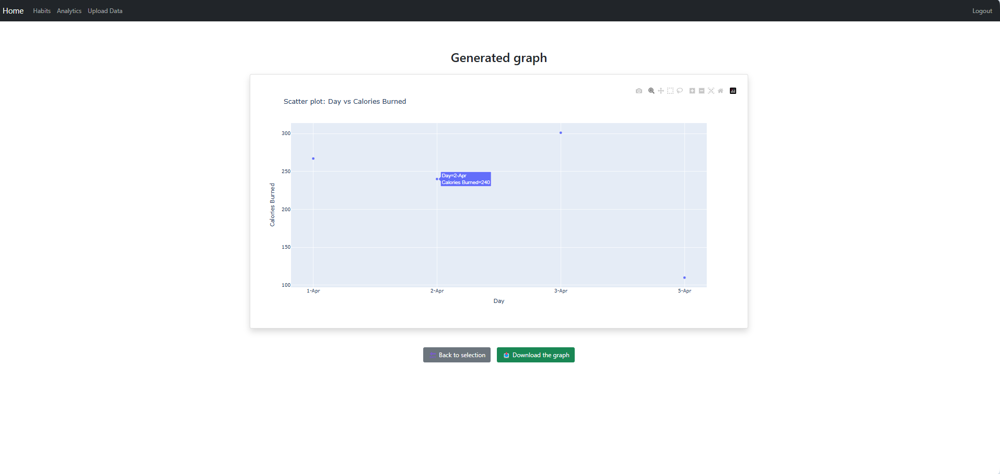

# Habit Tracker Website

## Features

- CRUD functions:Add, edit, and delete habits
- GitHub-style heatmap calendar ( to track ur habit/s in a calendar year)
- Analytics page with customizable charts
- Select chart type, habit, and time range
- Clean and user-friendly interface

  ## 🖼️ Interface

  ### Home Page

### Habits Page

### Analytics Page

### Upload Page Workflow
| **1. Upload your folder** |  |
| **2. Choose the type of graph** |  |
| **3. View the displayed graph** |  |
